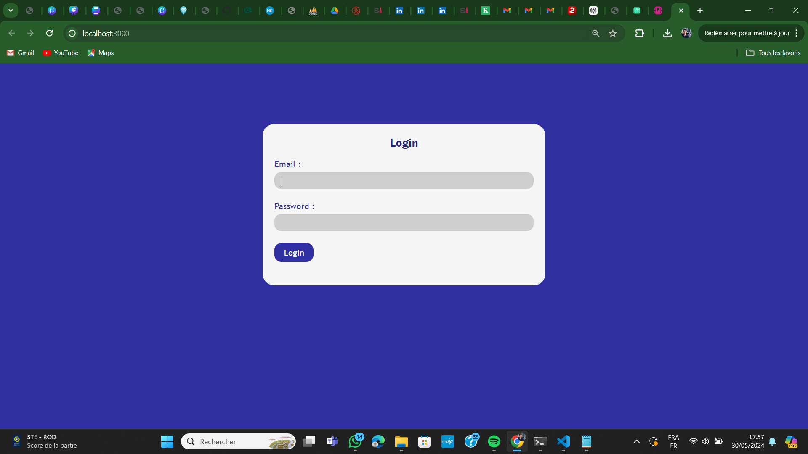

# ELECTROSHARE
Une Application WEB pour manager le processus d'envois, verification et telechargement de factures

# Vous Trouvez
-Dossier *PHP* : Contient le traitement du coté serveur \
-Dossier *REACT* : Contient le coté client \
-BD *electricity* : les tables 

- Veuillez Poser le Dossier PHP seul dans *htdocs* pour XAMPP ou dans *www* pour WAMP
- Puis se positionner dans le Dossier REACT et lancer la commande *npm start*
- Le port utilise pour phpmyadmin : *3306*

## Demo
- Espace Client :

- Espace Admin :

## Documentation

Pour Créer Un PDF -> TCPDF:
[Documentation](https://tcpdf.org/)

