# ELECTROSHARE
Une Application WEB pour manager le processus d'envois, verification et telechargement de factures
Un Client peut : 
- Declarer sa consommation par saisir la valeur indique sur le compteur accompagné d'une photo de ce dernier.
- Faire des reclamations.
- Telechargée les facteurs.
- Voir ses consommations précedentes.
Un Admin peut :
- Ajouter /Modifier les clients.
- Voir les factures non payée.
- Voir les factures ayant des anomalies et peut choisir de les acceptées ou non.
- Entrer Les consommations annuelles notées par les agents aprés leurs tours (Les consommations annuelles sont notées dans un fichier .txt comme indiquer au dessus)
Fonctionnalités Automatique du Plateforme :
- Si une consommation entrée par le client supérieur/inférieur de plus de 100kwh de la moyenne de ses consommations , c'est une anomalie.
- Si une consommation annuelle fournit par un agent a une marge de +50kwh avec la somme des consommayions entrer par le client durant l'année en question, une notification est envoyée au client
- Le prix de la facture est calculé automatiquement en respectant la formule des tranches et en ajoutant la TVA
- la facture est générée en format PDF.

# Vous Trouvez
-Dossier *PHP* : Contient le traitement du coté serveur \
-Dossier *REACT* : Contient le coté client \
-BD *electricity* : les tables 

- Veuillez Poser le Dossier PHP seul dans *htdocs* pour XAMPP ou dans *www* pour WAMP
- Puis se positionner dans le Dossier REACT et lancer la commande *npm start*
- Le port utilise pour phpmyadmin : *3306*

## Demo
- Espace Client :

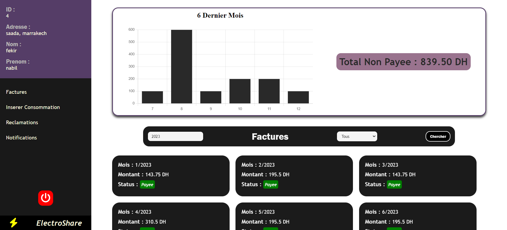
- Payée:
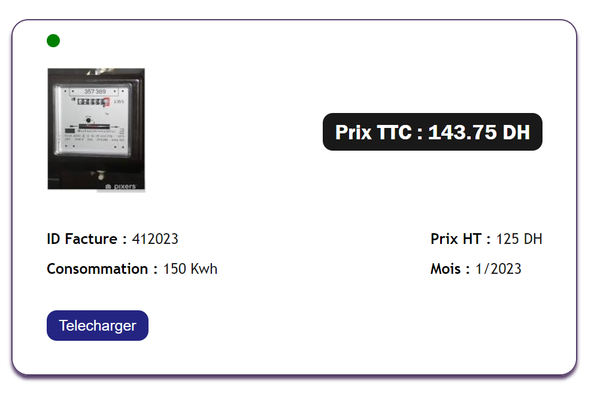
- Non Payée
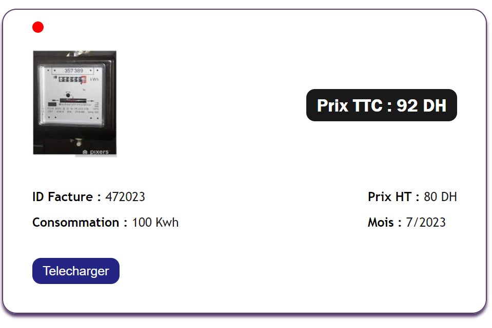
- Avec Anomalie (interdiction de télécharger la facutre)
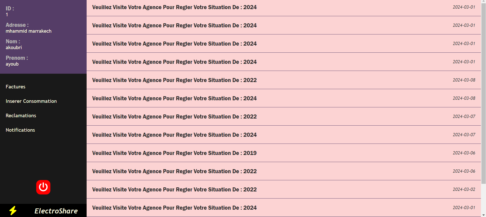
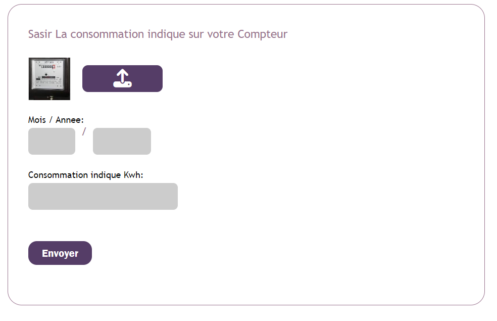
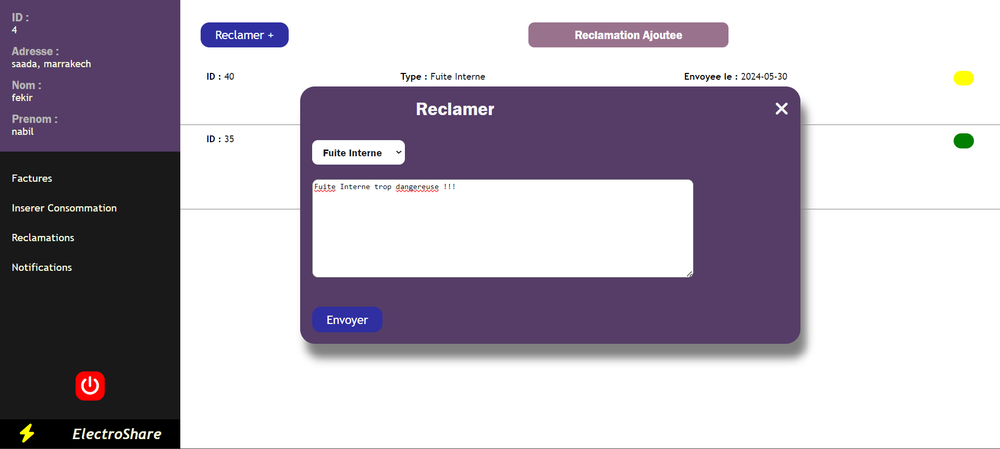
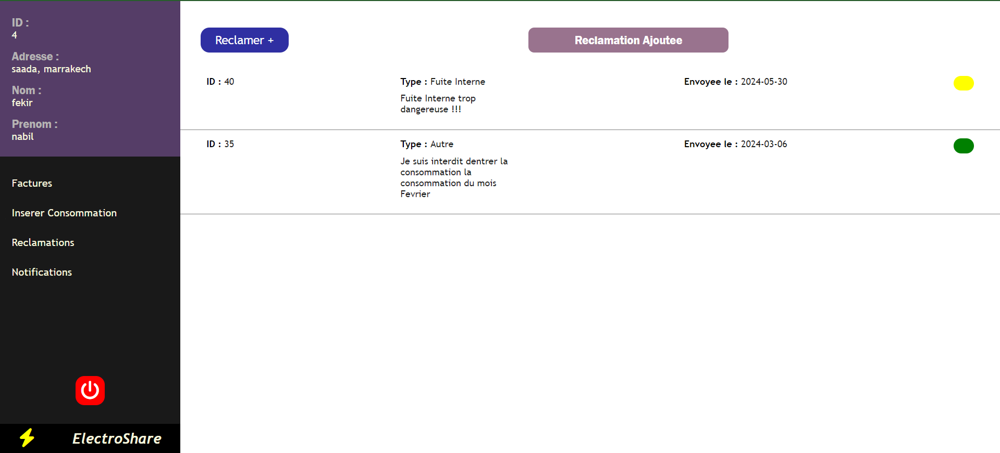
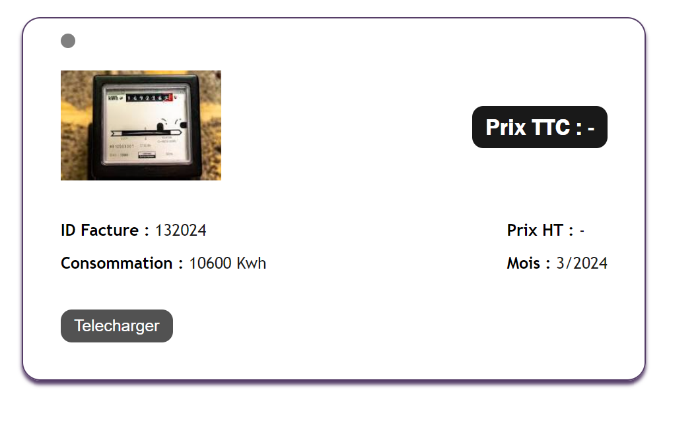
- Espace Admin :
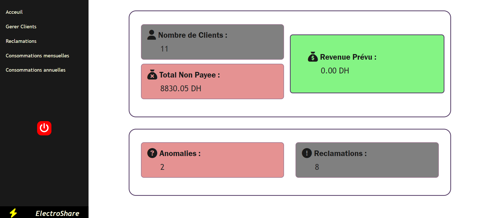
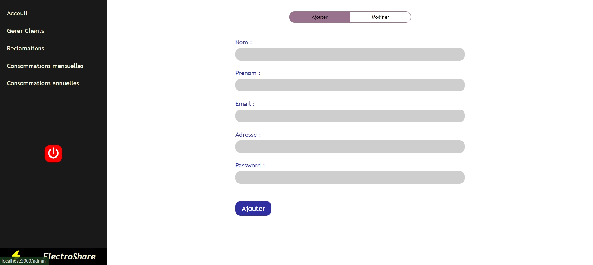
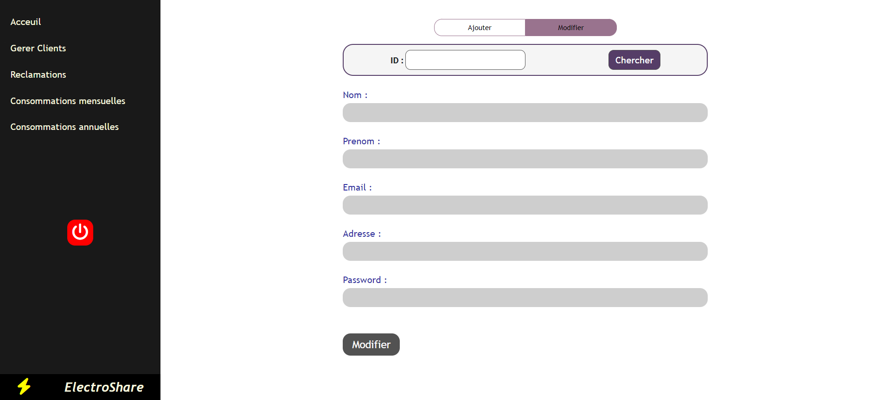
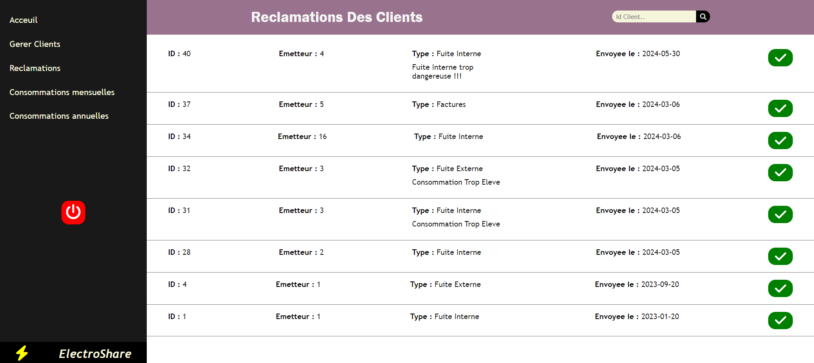
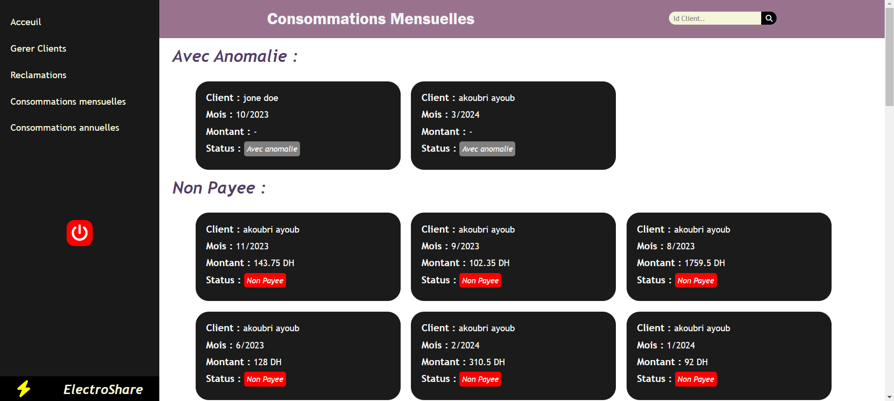
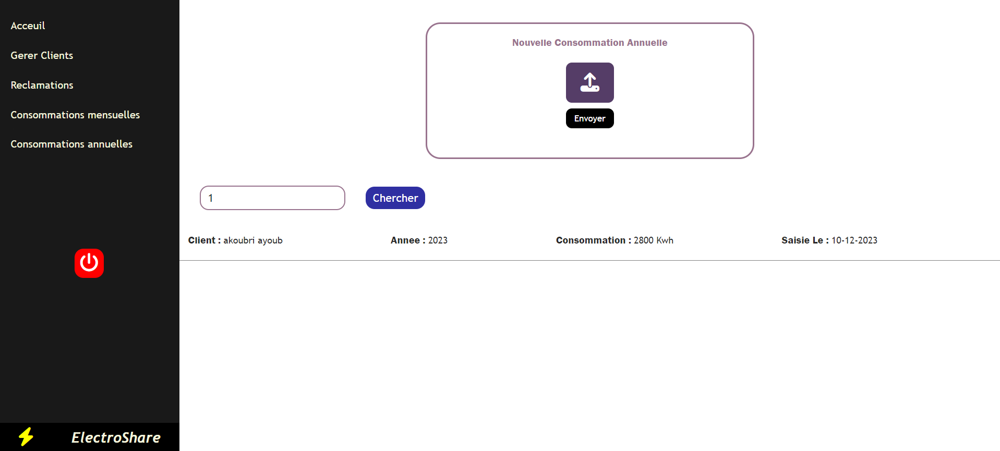

## Documentation

Pour Créer Un PDF -> TCPDF:
[Documentation](https://tcpdf.org/)

